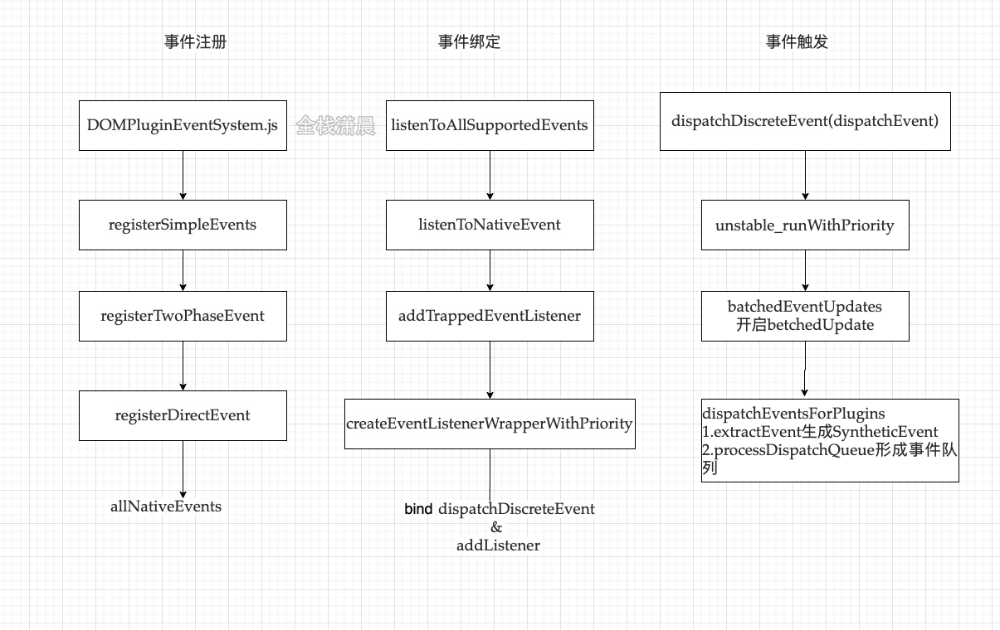
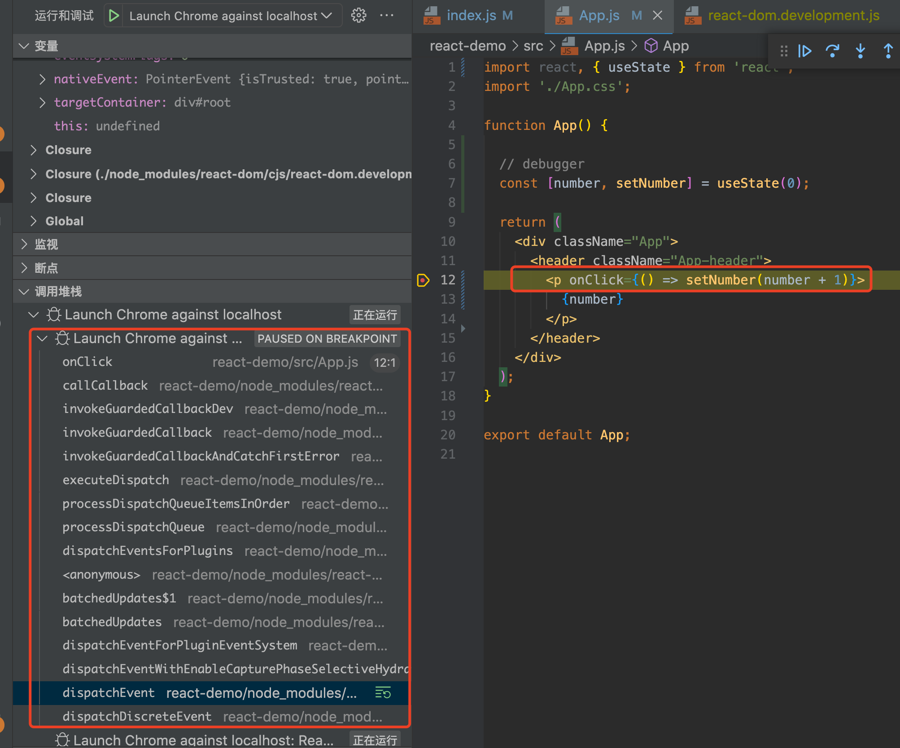

### react 事件系统

<!--  -->

- 事件注册

```javascript
// 注册事件入口包含5个函数
registerSimpleEvents();
registerEvents$2();
registerEvents$1();
registerEvents$3();
registerEvents();
```

所有事件存储在 allNativeEvents

```javascript
var allNativeEvents = new Set();

var simpleEventPluginEvents = [
  'abort',
  'auxClick',
  'cancel',
  'canPlay',
  'canPlayThrough',
  'click',
  'close',
  'contextMenu',
  'copy',
  'cut',
  'drag',
  'dragEnd',
  'dragEnter',
  'dragExit',
  'dragLeave',
  'dragOver',
  'dragStart',
  'drop',
  'durationChange',
  'emptied',
  'encrypted',
  'ended',
  'error',
  'gotPointerCapture',
  'input',
  'invalid',
  'keyDown',
  'keyPress',
  'keyUp',
  'load',
  'loadedData',
  'loadedMetadata',
  'loadStart',
  'lostPointerCapture',
  'mouseDown',
  'mouseMove',
  'mouseOut',
  'mouseOver',
  'mouseUp',
  'paste',
  'pause',
  'play',
  'playing',
  'pointerCancel',
  'pointerDown',
  'pointerMove',
  'pointerOut',
  'pointerOver',
  'pointerUp',
  'progress',
  'rateChange',
  'reset',
  'resize',
  'seeked',
  'seeking',
  'stalled',
  'submit',
  'suspend',
  'timeUpdate',
  'touchCancel',
  'touchEnd',
  'touchStart',
  'volumeChange',
  'scroll',
  'toggle',
  'touchMove',
  'waiting',
  'wheel'
];

function registerSimpleEvent(domEventName, reactName) {
  topLevelEventsToReactNames.set(domEventName, reactName);
  registerTwoPhaseEvent(reactName, [domEventName]);
}

function registerSimpleEvents() {
  for (var i = 0; i < simpleEventPluginEvents.length; i++) {
    var eventName = simpleEventPluginEvents[i];
    var domEventName = eventName.toLowerCase();
    var capitalizedEvent = eventName[0].toUpperCase() + eventName.slice(1);
    registerSimpleEvent(domEventName, 'on' + capitalizedEvent);
  } // Special cases where event names don't match.

  registerSimpleEvent(ANIMATION_END, 'onAnimationEnd');
  registerSimpleEvent(ANIMATION_ITERATION, 'onAnimationIteration');
  registerSimpleEvent(ANIMATION_START, 'onAnimationStart');
  registerSimpleEvent('dblclick', 'onDoubleClick');
  registerSimpleEvent('focusin', 'onFocus');
  registerSimpleEvent('focusout', 'onBlur');
  registerSimpleEvent(TRANSITION_END, 'onTransitionEnd');
}

function registerEvents$2() {
  registerDirectEvent('onMouseEnter', ['mouseout', 'mouseover']);
  registerDirectEvent('onMouseLeave', ['mouseout', 'mouseover']);
  registerDirectEvent('onPointerEnter', ['pointerout', 'pointerover']);
  registerDirectEvent('onPointerLeave', ['pointerout', 'pointerover']);
}

function registerEvents$1() {
  registerTwoPhaseEvent('onChange', ['change', 'click', 'focusin', 'focusout', 'input', 'keydown', 'keyup', 'selectionchange']);
}

function registerEvents$3() {
  registerTwoPhaseEvent('onSelect', [
    'focusout',
    'contextmenu',
    'dragend',
    'focusin',
    'keydown',
    'keyup',
    'mousedown',
    'mouseup',
    'selectionchange'
  ]);
}
```

- 事件绑定

在 createRoot 把监听事件挂载在 root 节点（实际上 react 根节点创建有 5 种方式，任意一种方式都会挂载监听事件，此处以 createRoot 为例）

```javascript
const root = ReactDOM.createRoot(document.getElementById('root'));

listenToAllSupportedEvents(rootContainerElement);

// allNativeEvents 就是上面注册的所有事件
// 这个方法的核心逻辑是 listenToNativeEvent

function listenToAllSupportedEvents(rootContainerElement) {
  if (!rootContainerElement[listeningMarker]) {
    rootContainerElement[listeningMarker] = true;
    allNativeEvents.forEach(function(domEventName) {
      if (domEventName !== 'selectionchange') {
        // 先冒泡阶段监听
        if (!nonDelegatedEvents.has(domEventName)) {
          listenToNativeEvent(domEventName, false, rootContainerElement);
        }

        // 再捕获阶段监听
        listenToNativeEvent(domEventName, true, rootContainerElement);
      }
    });
    var ownerDocument =
      rootContainerElement.nodeType === DOCUMENT_NODE ? rootContainerElement : rootContainerElement.ownerDocument;

    if (ownerDocument !== null) {
      // The selectionchange event also needs deduplication
      // but it is attached to the document.
      if (!ownerDocument[listeningMarker]) {
        ownerDocument[listeningMarker] = true;
        listenToNativeEvent('selectionchange', false, ownerDocument);
      }
    }
  }
}
```

listenToNativeEvent 做了一层包装，最终调了 addTrappedEventListener

```javascript
function listenToNativeEvent(domEventName, isCapturePhaseListener, target) {
  {
    if (nonDelegatedEvents.has(domEventName) && !isCapturePhaseListener) {
      error(
        'Did not expect a listenToNativeEvent() call for "%s" in the bubble phase. ' +
          'This is a bug in React. Please file an issue.',
        domEventName
      );
    }
  }

  var eventSystemFlags = 0;

  if (isCapturePhaseListener) {
    eventSystemFlags |= IS_CAPTURE_PHASE;
  }

  addTrappedEventListener(target, domEventName, eventSystemFlags, isCapturePhaseListener);
}
```

创建具有优先级的监听函数， createEventListenerWrapperWithPriority

节点上添加事件

```javascript
function addTrappedEventListener(
  targetContainer,
  domEventName,
  eventSystemFlags,
  isCapturePhaseListener,
  isDeferredListenerForLegacyFBSupport
) {
  //创建具有优先级的监听函数
  var listener = createEventListenerWrapperWithPriority(targetContainer, domEventName, eventSystemFlags); // If passive option is not supported, then the event will be
  // active and not passive.

  var isPassiveListener = undefined;

  if (passiveBrowserEventsSupported) {
    // Browsers introduced an intervention, making these events
    // passive by default on document. React doesn't bind them
    // to document anymore, but changing this now would undo
    // the performance wins from the change. So we emulate
    // the existing behavior manually on the roots now.
    // https://github.com/facebook/react/issues/19651
    if (domEventName === 'touchstart' || domEventName === 'touchmove' || domEventName === 'wheel') {
      isPassiveListener = true;
    }
  }

  targetContainer = targetContainer;
  var unsubscribeListener; // When legacyFBSupport is enabled, it's for when we

  //节点上添加事件
  if (isCapturePhaseListener) {
    if (isPassiveListener !== undefined) {
      unsubscribeListener = addEventCaptureListenerWithPassiveFlag(targetContainer, domEventName, listener, isPassiveListener);
    } else {
      unsubscribeListener = addEventCaptureListener(targetContainer, domEventName, listener);
    }
  } else {
    if (isPassiveListener !== undefined) {
      unsubscribeListener = addEventBubbleListenerWithPassiveFlag(targetContainer, domEventName, listener, isPassiveListener);
    } else {
      unsubscribeListener = addEventBubbleListener(targetContainer, domEventName, listener);
    }
  }
}
```

createEventListenerWrapperWithPriority 根据不同的事件类型包装事件

```javascript
/**
 * 调用getEventPriorityForPluginSystem返回事件的优先级
 * DiscreteEvent 离散事件 优先级 0 blur、focus、 click、 submit、 touchStart
 *   discreteEventPairsForSimpleEventPlugin数组中包含的item
 *   otherDiscreteEvents数组
 * UserBlockingEvent 用户阻塞事件 优先级 1 load、error、loadStart、abort、animationEnd
 *   userBlockingPairsForSimpleEventPlugin
 * ContinuousEvent 连续事件 优先级 2 优先级最高，会直接执行
 *   continuousPairsForSimpleEventPlugin
 */
function createEventListenerWrapperWithPriority(targetContainer, domEventName, eventSystemFlags) {
  var eventPriority = getEventPriority(domEventName);
  var listenerWrapper;

  switch (eventPriority) {
    case DiscreteEventPriority:
      listenerWrapper = dispatchDiscreteEvent;
      break;

    case ContinuousEventPriority:
      listenerWrapper = dispatchContinuousEvent;
      break;

    case DefaultEventPriority:
    default:
      listenerWrapper = dispatchEvent;
      break;
  }

  return listenerWrapper.bind(null, domEventName, eventSystemFlags, targetContainer);
}
```

设置一些属性，最终执行核心逻辑 dispatchEvent，派发事件

```javascript
function dispatchDiscreteEvent(domEventName, eventSystemFlags, container, nativeEvent) {
  var previousPriority = getCurrentUpdatePriority();
  var prevTransition = ReactCurrentBatchConfig.transition;
  ReactCurrentBatchConfig.transition = null;

  try {
    setCurrentUpdatePriority(DiscreteEventPriority);
    dispatchEvent(domEventName, eventSystemFlags, container, nativeEvent);
  } finally {
    setCurrentUpdatePriority(previousPriority);
    ReactCurrentBatchConfig.transition = prevTransition;
  }
}
```

addTrappedEventListener 中添加事件

注册捕获事件 addEventCaptureListener
注册冒泡事件 addEventBubbleListener

```javascript
/**
 * 添加的监听事件如下
 * target 是挂载事件的容器
 *
 * listener 可以理解为
 * dispatchDiscreteEvent
 * dispatchContinuousEvent
 * dispatchEvent
 *
 * 最终执行的核心逻辑都是  dispatchEvent
 * 根据事件的优先级调用不同的方法
 *
 * react 16事件流程
 * 1. document 捕获
 * 2. 父元素原生捕获
 * 3. 子元素原生捕获
 * 4. 子元素原生冒泡
 * 5. 父元素原生冒泡
 *
 * 6. 父元素react捕获
 * 7. 子元素react捕获
 * 8. 子元素react冒泡
 * 9. 父元素react冒泡
 * 10. document冒泡
 * 16没有分别绑定冒泡和捕获
 *
 * 17分别绑定冒泡和捕获
 * react 17事件流程
 * 1. 原生root捕获
 * 2. 父元素react捕获(root捕获)
 * 3. 子元素react捕获(root捕获)
 * 4. 父元素原生捕获
 * 5. 子元素原生捕获
 *
 * 6. 父元素原生冒泡
 * 7. 子元素原生冒泡
 * 8. 子元素react冒泡(root冒泡)
 * 9. 父元素react冒泡(root冒泡)
 * 10 原生root冒泡
 *
 * 此处监听的事件就是react的事件冒泡和捕获
 *
 */

// root 冒泡 listener可以间接理解为 dispatchEvent
function addEventBubbleListener(target, eventType, listener) {
  target.addEventListener(eventType, listener, false);
  return listener;
}

// root 捕获 listener可以间接理解为 dispatchEvent
function addEventCaptureListener(target, eventType, listener) {
  target.addEventListener(eventType, listener, true);
  return listener;
}
function addEventCaptureListenerWithPassiveFlag(target, eventType, listener, passive) {
  target.addEventListener(eventType, listener, {
    capture: true,
    passive: passive
  });
  return listener;
}
function addEventBubbleListenerWithPassiveFlag(target, eventType, listener, passive) {
  target.addEventListener(eventType, listener, {
    passive: passive
  });
  return listener;
}
```

- 事件触发

当我们触发一个 click 事件时，通过调用栈，我们来梳理一下整个点击过程


因为事件注册在 root 节点上，因此点击刚开始我们就可以通过事件捕获监听到 root 被点击

根据真实被点击的dom节点找到react Fiber实例
```javascript
// 通过 getEventTarget 获取原生事件被点击的是哪个dom原生
var nativeEventTarget = getEventTarget(nativeEvent);

/**
 * 通过原生事件获取是哪个react实例
 * React 在初始化真实 dom 的时候，用一个随机的 key
 * internalInstanceKey 指针指向了当前dom对应的fiber对象，
 * fiber对象用stateNode指向了当前的dom元素
 *
 * targetNode -> dom -> targetInst -> 与之对应的fiber对象
 */
var targetInst = getClosestInstanceFromNode(nativeEventTarget);
```

通过Fiber的return完成事件冒泡，找到所有注册的同类事件，比如click
```javascript
/**
 * targetInst -> return_targetInst
 * findInstanceBlockingEvent 找到
 * 然后执行  batchedUpdates
 */
dispatchEventForPluginEventSystem(domEventName, eventSystemFlags, nativeEvent, return_targetInst, targetContainer) {
  // 省略查找root的过程 找到 ancestorInst 祖先节点
  // 最终执行下面的批量更新
  batchedUpdates(function () {
    return dispatchEventsForPlugins(domEventName, eventSystemFlags, nativeEvent, ancestorInst);
  });
};
```

dispatchEventsForPlugins 获取事件

```javascript
/**
 * 获取批量事件
 * extractEvents$5 的核心函数是 accumulateSinglePhaseListeners
 * 这个核心是listener真正收集的地方
 *
 */
function dispatchEventsForPlugins(domEventName, eventSystemFlags, nativeEvent, targetInst, targetContainer) {
  var nativeEventTarget = getEventTarget(nativeEvent);
  var dispatchQueue = [];
  extractEvents$5(dispatchQueue, domEventName, targetInst, nativeEvent, nativeEventTarget, eventSystemFlags);
  processDispatchQueue(dispatchQueue, eventSystemFlags);
}
```

accumulateSinglePhaseListeners 向上遍历找到所有节点注册的和点击节点同类事件 模拟冒泡

```javascript
/**
 * accumulateSinglePhaseListeners
 * 比如被点击的事件是click 那么就获取当前节点到根节点的所有click事件
 * 其实是模拟冒泡的过程
 */
function accumulateSinglePhaseListeners(targetFiber, reactName, nativeEventType, inCapturePhase, accumulateTargetOnly, nativeEvent) {
  var captureName = reactName !== null ? reactName + 'Capture' : null;
  var reactEventName = inCapturePhase ? captureName : reactName;
  var listeners = [];
  var instance = targetFiber;
  var lastHostComponent = null; // Accumulate all instances and listeners via the target -> root path.

  while (instance !== null) {
    var _instance2 = instance,
        stateNode = _instance2.stateNode,
        tag = _instance2.tag; // Handle listeners that are on HostComponents (i.e. <div>)

    if (tag === HostComponent && stateNode !== null) {
      lastHostComponent = stateNode; // createEventHandle listeners


      if (reactEventName !== null) {
        var listener = getListener(instance, reactEventName);

        if (listener != null) {
          listeners.push(createDispatchListener(instance, listener, lastHostComponent));
        }
      }
    } // If we are only accumulating events for the target, then we don't
    // continue to propagate through the React fiber tree to find other
    // listeners.


    if (accumulateTargetOnly) {
      break;
    } // If we are processing the onBeforeBlur event, then we need to take

    instance = instance.return;
  }

  return listeners;
} /
```

processDispatchQueue

```javascript
/**
 * processDispatchQueue
 * 批量更新 事件冒泡
 *
 */
function processDispatchQueue(dispatchQueue, eventSystemFlags) {
  var inCapturePhase = (eventSystemFlags & IS_CAPTURE_PHASE) !== 0;

  for (var i = 0; i < dispatchQueue.length; i++) {
    var _dispatchQueue$i = dispatchQueue[i],
        event = _dispatchQueue$i.event,
        listeners = _dispatchQueue$i.listeners;
    processDispatchQueueItemsInOrder(event, listeners, inCapturePhase); //  event system doesn't use pooling.
  } // This would be a good time to rethrow if any of the event handlers threw.


  rethrowCaughtError();
}
```

batchedUpdates

```javascript
/**
 * batchedUpdates
 *
 */
```

accumulateTwoPhaseListeners 收集冒泡和捕获事件
```javascript
/**
 * listeners = [根节点捕获，父节点捕获，目标节点捕获，目标节点冒泡，父节点冒泡，根节点冒泡]
 */
function accumulateTwoPhaseListeners(targetFiber, reactName) {
  var captureName = reactName + 'Capture';
  var listeners = [];
  var instance = targetFiber; // Accumulate all instances and listeners via the target -> root path.

  while (instance !== null) {
    var _instance3 = instance,
        stateNode = _instance3.stateNode,
        tag = _instance3.tag; // Handle listeners that are on HostComponents (i.e. <div>)

    if (tag === HostComponent && stateNode !== null) {
      var currentTarget = stateNode;
      var captureListener = getListener(instance, captureName);

      if (captureListener != null) {
        listeners.unshift(createDispatchListener(instance, captureListener, currentTarget));
      }

      var bubbleListener = getListener(instance, reactName);

      if (bubbleListener != null) {
        listeners.push(createDispatchListener(instance, bubbleListener, currentTarget));
      }
    }

    //通过while循环和 return获取从当前节点向上查找，知道没有父亲节点为止
    instance = instance.return;
  }

  return listeners;
}
```

参考：

- https://blog.csdn.net/zz2000aa/article/details/124162466
- https://zhuanlan.zhihu.com/p/370034592
