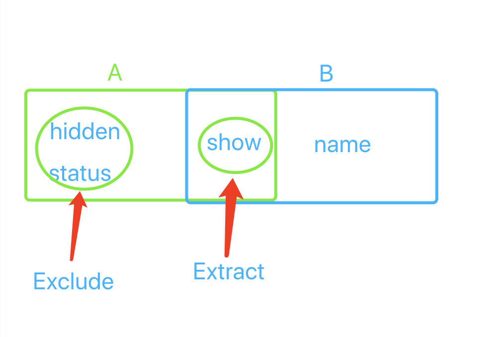

- as 断言，我断定这个类型试试是什么

  > 有时候你会比 ts 更了解每个类型的信息

  ```javascript
  let someValue: any = "this is a string";
  let strLength: number = (someValue as string).length;

  let child: HTMLElement = allChildren[i] as HTMLElement;
  ```

- infer 用于类型的提取，然后存到一个变量里，相当于局部变量

  ```javascript
  type GetValueType<P> = P extends Promise<infer Value> ? Value : never;
  ```

  ```javascript
  // 返回的类型时数组的第一项
  type GetFirst<Arr extends unknown[]> = Arr extends [infer First, ...unknown[]] ? First : never;
  // 此时的 GetFirstResult 返回的类型就是 number
  type GetFirstResult = GetFirst<[number,string,boolean]>;
  ```

- keyof (keyof 与 Object.keys 略有相似，只是 keyof 是取 interface 的键，而且 keyof 取到键后会保存为联合类型)

  ```javascript
  function getValue<T extends Object, K extends keyof T>(o:T, key: K): T[K] {
    return o[key]
  }

  // 看起来泛型中存在类型推断，
  // 当定义了obj1 -> T，K约束为obj1的一个key，
  // o: { name: string; age: number; }, key: "name" | "age"): string | number
  const obj1 = {name: 'zhangsan', age: 18}
  const a = getValue(obj1, 'age')
  ```

[试一试](https://www.typescriptlang.org/play?#code/GYVwdgxgLglg9mABAcwKZQGoEMA2JUA8AKoqgB5SpgAmAzogPIBGAVqtADSIDSpFVdRAGtUATzjBERAHwAKOAC4iXEaIU8AlOqIBtbgF1EAbwBQiRACd0IC0jg7V+kwF8TJiAlpREcVgEZEAF5jMCwAW1R1AHIALwALLDBkWkSoriw0dT8ADlcPMC9ELCCUdGw8VHl-LiiM1CiNIA)

- in (in 用于取联合类型的值。主要用于数组和对象的构造， 但切记不要用于 interface，否则会出错)

  ```javascript
  type name = 'firstName' | 'lastName';
  /**
   * type TName = {
      firstName: string;
      lastName: string;
  }
  **/
  type TName = {
    [key in name]: string;
  };

  ```

- extends 不同场景下的含义

  - 在 class 中使用表示：继承父类的属性和方法

    ```javascript
    class Animal {
      kind = 'animal';
      constructor(kind) {
        this.kind = kind;
      }
      sayHello() {
        console.log(`Hello, I am a ${this.kind}!`);
      }
    }

    class Dog extends Animal {
      constructor(kind) {
        super(kind);
      }
      bark() {
        console.log('wang wang');
      }
    }

    const dog = new Dog('dog');
    dog.name; //  => 'dog'
    dog.sayHello(); // => Hello, I am a dog!
    ```

  - 在接口定义中使用，表示继承某个类型

    ```javascript
    interface Animal {
      kind: string;
    }

    interface Dog extends Animal {
      bark(): void;
    }
    // Dog => { name: string; bark(): void }
    ```

  - 在写泛型的时候，表示 `泛型约束`

    ```javascript
    // 这里extends对传入的参数作了一个限制，就是 entities 的每一项可以是一个对象，但是必须含有类型为string的cname属性
    function getCnames<T extends { name: string }>(entities: T[]):string[] {
      return entities.map(entity => entity.cname)
    }
    ```

  - 在条件类型和高阶类型中判断一个类型是否可以分配给另一个类型 `可被分配`
    > 复杂示例： react/v16/index.d.ts 第 116 行
    ```javascript
    // A extends B，是指 类型A可以分配给类型B，而不是说类型A是类型B的子集
    type Human = {
      name: string;
      occupation: string;
    }
    type Duck = {
      name: string;
    }
    // Duck 没有类型为string的occupation属性，类型Duck不满足类型Human的类型约束
    type Bool = Duck extends Human ? 'yes' : 'no'; // Bool => 'no'
    ```

* readonly

  - 只读常量

  - 只读对象 Readonly<T>

    ```javascript
    interface Person {
      name: string;
    }
    type Person2 = Readonly<Person>;
    // 此时的对象a就是只读的
    const a: Person2 = {
      name: 'wangly19'
    };
    ```

  - 实现 Readonly
    ```typescript
    // 先用keyof转为联合类型，再用in取联合类型的值
    type MyReadonly<T> = { readonly [P in keyof T]: T[P] };
    ```

* Record

  - Record 能够快速创建对象类型。它的使用方式是 Record<K, V>，能够快速的为 object 创建统一的 key 和 value 类型

  ```javascript
  // 例如：创建对象，key是string,value也是string
  const person: Record<string, string> = {
    name: 'samccao',
    age: 22 // Type `number` is not assignable to type `string`
  };
  ```

* Required 把非必须变为必须的

  ```javascript
  interface Props {
    a?: number;
    b?: string;
  }

  const obj: Props = { a: 5 };

  const obj2: Required<Props> = { a: 5 };
  //Property 'b' is missing in type '{ a: number; }' but required in type 'Required<Props>'.
  ```

- Pick & Omit

  - Pick：主要作用是从一组属性中拿出某个属性，并将其返回
  - Omit：主要作用是从一组属性中排除某个属性，并将排除属性后的结果返回
    > Pick 的使用方法是 Pick<P, K>，如（P）类型中拥有 name,age,desc 三个属性，那么 K 为 name 则最终将取到只有 name 的属性，其他的将会被排出

  ```typescript
  // 例如：创建对象，key是string,value也是string
  interface Person {
    name: string;
    age: number;
  }
  type age = Pick<Person, 'age'>;
  // 此时的 age 等价于 type age = {age: number;}

  // 实现pick
  type MyPick<T, K extends keyof T> = { [P in K]: T[P] };

  type name = Omit<Person, 'age'>;
  // 此时的 name 等价于 type name = {name: string;}

  // 实现omit
  // 先用 keyof转为联合类型，此时的key为联合类型的一种
  type MyOmit<T, K extends keyof T> = {
    [P in MyExclude<keyof T, K>] : T[P];
  }

  /**
   * T通过keyof T转为了联合类型 和 U 都是联合类型
   * (name | age) extends (age) 
   * name extends age => name;
   * age extends age => never;
   * T extends U 中的 T代表 name | age
   * never : T 中的 T 代表联合类型的每一项，比如name或者age
   * 因此最终返回的是 name 
   */
  type MyExclude<T, U> = T extends U ? never : T

  ```

* Exclude & Extract

  - 
  - Exclude(差集): 从一个联合类型中排除掉属于另一个联合类型的子集

    ```javascript
    interface A {
      show: boolean,
      hidden: boolean,
      status: string
    }

    interface B {
      show: boolean;
      name: string;
    }

    type outPut = Exclude<keyof A, keyof B>

    // 此时的 outPut 等价于 type outPut = "hidden" | "status"
    ```

  - Extract(交集): 跟 Exclude 相反，从从一个联合类型中取出属于另一个联合类型的子集

    ```javascript
    interface A {
      show: boolean;
      hidden: boolean;
      status: string;
    }

    interface B {
        show: boolean;
        name: string;
    }

    type outPut = Extract<keyof A, keyof B>
    // 此时的 outPut 等价于 type outPut = "show"
    ```

* Partial 将一个类型转为可选类型

  > 对于不明确的类型来说，需要将所有的属性转化为可选的?.形式，转换成为可选的属性类型

  ```javascript
  interface Human {
    name: string;
    occupation: string;
  }
  const a: Partial<Human> = {};
  // 等价于 type Partial<T> = { [P in keyof T]?: T[P] | undefined; }

  console.log(a.name); // 提示 (property) name?: string | undefined
  ```

  [试一试](https://www.typescriptlang.org/play?#code/ATCWDsBcFMCcDMCGBjawASBXAto8wBvAKBBHEW2gC5gBnSWCAcwG4TSB7ZZTAB0UigO4GvUbhW7AL7tkw+sEQ0AColiDEAGwA8WXOAB8wALyEZs+R03QAdJo5MAFIhvlKASiA)

* declare [参考资料](http://ts.xcatliu.com/basics/declaration-files.html)

  - declare var let const 声明全局变量 (只能用来定义类型，不能用来定义具体的实现)

  ```javascript
  // declare var 并没有真的定义一个变量，只是定义了全局变量 jQuery 的类型，
  // 仅仅会用于编译时的检查，在编译结果中会被删除
  // 声明语句中只能定义类型，切勿在声明语句中定义具体的实现
  declare var jQuery: (selector: string) => any;
  jQuery('#foo');
  ```

  - declare function 声明全局方法 (只能用来定义类型，不能用来定义具体的实现)
  - declare class 声明全局类 (只能用来定义类型，不能用来定义具体的实现)
  - declare enum 声明全局枚举类型 (只能用来定义类型，不能用来定义具体的实现)
  - declare namespace 声明（含有子属性的）全局对象
  - declare global 扩展全局变量
  - declare module 扩展模块
  - 什么是声明文件 （通常我们会把声明语句放到一个单独的文件（jQuery.d.ts）中，这就是声明文件）

  ```javascript
  // src/jQuery.d.ts
  declare var jQuery: (selector: string) => any;
  ```

* namespace (它用来表示全局变量是一个对象，包含很多子属性)

  ```javascript
  // src/jQuery.d.ts
  // 1. 除了全局变量之外，可能有一些类型我们也希望能暴露出来。在类型声明文件中，我们可以直接使用 interface 或 type

  // 2. 暴露在最外层的 interface 或 type 会作为全局类型作用于整个项目中，
  // 我们应该尽可能的减少全局变量或全局类型的数量。故最好将他们放到 namespace
  interface AjaxSettings {
      method?: 'GET' | 'POST'
      data?: any;
  }

  declare namespace jQuery {
    // 在 declare namespace 内部，我们直接使用 function ajax 来声明函数，
    // 而不是使用 declare function ajax。类似的，也可以使用 const, class, enum 等语句
      function ajax(url: string, settings?: any): void;
      const version: number;
      class Event {
          blur(eventType: EventType): void
      }
      enum EventType {
          CustomClick
      }
      // 如果对象拥有深层的层级，则需要用嵌套的 namespace 来声明深层的属性的类型
      namespace fn {
          function extend(object: any): void;
      }
  }
  ```

  ```javascript
  // src/index.ts
  // 类型声明文件中通过interface或者type声明的AjaxSettings可以直接在ts文件中使用，因为是全局的
  let settings: AjaxSettings = {
    method: 'POST',
    data: {
      name: 'foo'
    }
  };

  jQuery.ajax('/api/get_something');
  jQuery.fn.extend({
    check: function() {
      return this.each(function() {
        this.checked = true;
      });
    }
  });
  ```

- global

  > 在 d.ts 声明文件中，任何的 declare 默认就是 global 的了，所以你在 d.ts 文件中是不能出现 declare global 的。只有在模块文件中的定义，如果想要全局就使用 declare global

  - global.d.ts 全局库是可以从全局范围访问的（即不使用任何形式的）import

  - 某个文件中的 global，可以全局用

  ```javascript
  declare global {
  /*~ Here, declare things that go in the global namespace, or augment
   *~ existing declarations in the global namespace
   */
  interface String {
    fancyFormat(opts: StringFormatOptions): string;
    }
  }
  ```

* abstract (用 abstract 关键字定义抽象类和抽象方法)

  - 抽象类中的抽象方法不包含具体实现并且必须在派生类(抽象类的子类)中实现
  - 抽象类：它是提供其他类继承的基类，不能直接被实例化，子类继承可以被实例化
  - abstract 修饰的方法(抽象方法)只能放在抽象类里面
  - 抽象类和抽象方法用来定义标准(比如定义标准为：抽象类 Animal 有抽象方法 eat，要求它的子类必须包含 eat 方法)
  - 抽象类和抽象方法的一种实现案例: [神光的编程秘籍: Nest.js 用了 Express 但也没完全用](https://mp.weixin.qq.com/s/qcy5sL0sV6wnxif8EEBrMQ)

  ```javascript
  abstract class People {
    name : string
    constructor (name:string) {
        this.name = name
    }
    abstract eat (food:string) :void;//抽象方法不包括具体实现，并且必须再派生类中实现
  }

  class Stud1 extends People {
      //抽象类的子类必须实现抽象类中的抽象方法
      constructor (name:string) {
          super(name)
      }
      eat(food: string): void {
          console.log(`我爱吃 ${food}`)
      }

  }

  const stu11 : Stud1 = new Stud1('liu')
  stu11.eat('面条')
  ```

* implements（实现）[参考](http://ts.xcatliu.com/advanced/class-and-interfaces.html)

  - implements 实现，一个新的类，从父类或者接口实现所有的属性和方法，同时可以重写属性和方法，包含一些新的功能
  - extends 继承，一个新的接口或者类，从父类或者接口继承所有的属性和方法，不可以重写属性，但可以重写方法

  ```javascript
  // 假设我有一个干净的抽象类A：
  abstract class A {
    abstract m(): void;
  }

  // 在实现方面（implement），在TypeScript中也可以去implement一个类：
  // implements关键字将类A当作一个接口，这意味着类C必须去实现定义在A中的所有方法，
  // 无论这些方法是否在类A中有没有默认的实现。同时，也不用在类C中定义super方法。
  class C implements A {
    m(): void { }
  }

  // 在继承(extends)方面，就像C#或者java里面那样，我可以像下面这样来继承这个抽象类：
  // extends 是对某个类的继承，可获取父类的所有的静态属性
  class B extends A{}
  ```

  - 一般来讲，一个类只能继承自另一个类，有时候不同类之间可以有一些共有的特性，
    这时候就可以把特性提取成接口（interfaces），用 implements 关键字来实现。
    这个特性大大提高了面向对象的灵活性

    > 举例来说，门是一个类，防盗门是门的子类。如果防盗门有一个报警器的功能，我们可以简单的给防盗门添加一个报警方法。
    > 这时候如果有另一个类，车，也有报警器的功能，就可以考虑把报警器提取出来，作为一个接口，防盗门和车都去实现它

    ```javascript
    interface Alarm {
      alert(): void;
    }

    class Door {}

    class SecurityDoor extends Door implements Alarm {
      alert() {
        console.log('SecurityDoor alert');
      }
    }

    class Car implements Alarm {
      alert() {
        console.log('Car alert');
      }
    }
    ```

  - 一个类可以实现多个接口：

    ```javascript
    interface Alarm {
      alert(): void;
    }

    interface Light {
      lightOn(): void;
      lightOff(): void;
    }

    class Car implements Alarm, Light {
      alert() {
        console.log('Car alert');
      }
      lightOn() {
        console.log('Car light on');
      }
      lightOff() {
        console.log('Car light off');
      }
    }
    ```

* type 和 interface 区别对比

  - type 叫做类型别名，其实就是声明一个变量存储某个类型。
  - 因为 联合类型 和 交叉类型 是很常用的，所以避免不了大量使用 type 的场景，一些复杂类型也需要通过组装后形成类型别名来使用
  - 类型别名与字符串字面量类型都是使用 type 进行定义

  ```javascript
  // 1. type 可以定义基本类型(string, number)别名, 但是interface无法定义
  type userName = string;

  // 2. type 可以声明联合类型, interface不可以
  type Student = { stuNo: number } | { classId: number };

  // 3.  type可以声明 元组类型：interface不可以
  type Data = [number, string];

  // 4. 字符串字面量类型也是使用type定义
  type EventNames = 'click' | 'scroll' | 'mousemove';

  // 4. type也可以被接口继承
  interface B extends Student {
    sam: 'string';
  }
  ```

  - interface （官方推荐用 interface，其他无法满足需求的情况下用 type）

  ```javascript
  // 1. 重复的声明会合并，类似于 type 声明联合类型，type这样写会报错
  interface Person {
    name: string;
  }
  interface Person {
    age: number;
  }

  let user: Person = {
    name: 'Tolu',
    age: 0
  };
  ```

* 三斜杠 reference

  > TypeScript 作为 JavaScript 的超集，在开发过程中不可避免要引用其他第三方的 JavaScript 的库。虽然通过直接引用可以调用库的类和方法，但是却无法使用 TypeScript 诸如类型检查等特性功能。为了解决这个问题，需要将这些库里的函数和方法体去掉后只保留导出类型声明，而产生了一个描述 JavaScript 库和模块信息的声明文件。通过引用这个声明文件，就可以借用 TypeScript 的各种特性来使用库文件了
  > 当然也可以用在 TS 文件中，以便使用引用文件的属性和方法

  ```javascript
  /// <reference types="sizzle" />
  /// <reference path="JQueryStatic.d.ts" />
  // 在JS文件中如果使用了声明文件，就可以使用声明文件的提示了
  ```

  - 对这些包的名字的解析与在 import 语句里对模块名的解析类似。 可以简单地把三斜线类型引用指令当做 import 声明的包。
    例如，把 `/// <reference types="node" />` 引入到声明文件，表明这个文件使用了 `@types/node/index.d.ts` 里面声明的名字；
    并且，这个包需要在编译阶段与声明文件一起被包含进来。
