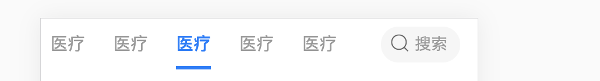

```jsx harmony
import React, { Component } from 'react';
import classname from 'classnames';
import './index.scss';

class SearchType extends Component {
  constructor(props) {
    super(props);
    const initTypeList = Array(21).fill(1).map((item, index) => {
      return {
        label: '医疗',
        value: index,
      };
    });
    this.state = {
      typeList: initTypeList,
      activeIndex: 0,
    };
  }

  handleClickItem = (e, item, index) => {
    const { typeList, activeIndex } = this.state;
    const length = typeList.length;

    // 滚动到的位置，如果点击当前后面的某个就让被点击的后面两个进入视口。如果点的是当前前面的某个
    // 就让被点击的前面两个滚动进视口 
    let scrollIndex = activeIndex > index ? index - 2 : index + 2;

    // 边界判定
    if (scrollIndex > length - 1) {
      scrollIndex = length - 1;
    }
    if (scrollIndex < 0) {
      scrollIndex = 0;
    }

    const element = document.getElementsByClassName('search-type-item')[scrollIndex];

    // 使用behavior:smooth定义动画过渡效果。block:定义垂直对齐方向。inline:定义水平对齐方向。
    element.scrollIntoView({ behavior: 'smooth', block: 'end', inline: 'nearest' });
    this.setState({
      activeIndex: index,
    });
  };

  render() {
    const { typeList, activeIndex } = this.state;
    return (
      <div className="search-type">
        {typeList.map((item, index) => {
          const cls = classname({
            'search-type-item': true,
            active: index === activeIndex,
          });
          return <div className={cls} key={item.value} onClick={e => this.handleClickItem(e, item, index)}>医疗</div>;
        })}
      </div>
    );
  }
}

export default SearchType;
```

```scss
@import 'client/styles/func.scss';
@import 'client/styles/variables.scss';

.search-type {
  padding-left: r(16);
  display: flex;
  flex-wrap: nowrap;
  white-space: nowrap;
  align-items: center;
  overflow-x: scroll;

  &::-webkit-scrollbar {
    display: none; /* Chrome Safari */
  }

  &-item {
    flex: 1;
    position: relative;
    font-size: r(30);
    font-family: PingFangSC-Regular;
    color: #999;
    text-align: center;
    margin: 0 r(24);

    &:first-child {
      margin-left: 0;
    }

    &.active {
      color: #057aff;
      font-family: PingFangSC-Medium;

      &:after {
        content: '';
        position: absolute;
        bottom: 0;
        left: 0;
        right: 0;
        width: 100%;
        height: r(6);
        background: #057aff;
      }
    }
  }
}
```


