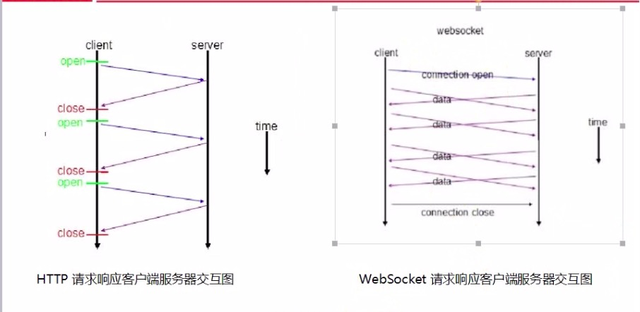

#### 1.websocket基本特性介绍

1. 实现了浏览器和服务器全双工通信 full-deple 

2. websocket 需要低层的http模块支持 一般都需要引入http模块

3. 一开始的握手需要借助http请求完成 也区分80 和443默认端口号

4. websocket不需要多次建立连接 是一直连接的 都可以主动的向对方发送信息

5. 请求头比http多了upgread

6. IE10才开始支持 其它浏览器都好

7. 没有同源限制，客户端可以与任意服务器通信，是实现跨域的一种方式

8. 建立在TCP协议上

9. 可以发送文本，也可以发送二进制数据

10. 协议标识符是ws,如果加密是wss,服务器网址就是URL




#### 2.websocket API介绍

1. 创建websocket

```javascript
var ws = new WebSocket('localhost: 8080');
```

2. 方法

close(code, reason);

send(data);

3. 属性

```javascript
// 链接中
ws.onopen = function(evt){
    ws.send('Hello Server!');
}

// 处理服务端返回的数据
ws.onmessage = function(evt){
    var data = evt.data;
}

// 关闭
ws.onclose = function(evt){
    
}

// 发生错误
ws.onerror = function(evt) {
    
}

ws.addEventListener('open', function (event) {
  ws.send('Hello Server!');
});

// 0 CONNECTING 正在建立连接，还没有完成
// 1 OPEN 连接成功 可以通信了
// 2 CLOSING 连接正在进行关闭握手，即将关闭 
// 3 CLOSED连接已经关闭，或者根本没有建立连接
ws.readyState = 0 || 1 || 2 || 3;

// 发送数据的api
ws.send('name:sam')

```

#### 3.常用的工具包 

> 主要有 websocket socket.io ws模块

socket.io是node实现的常用方式

