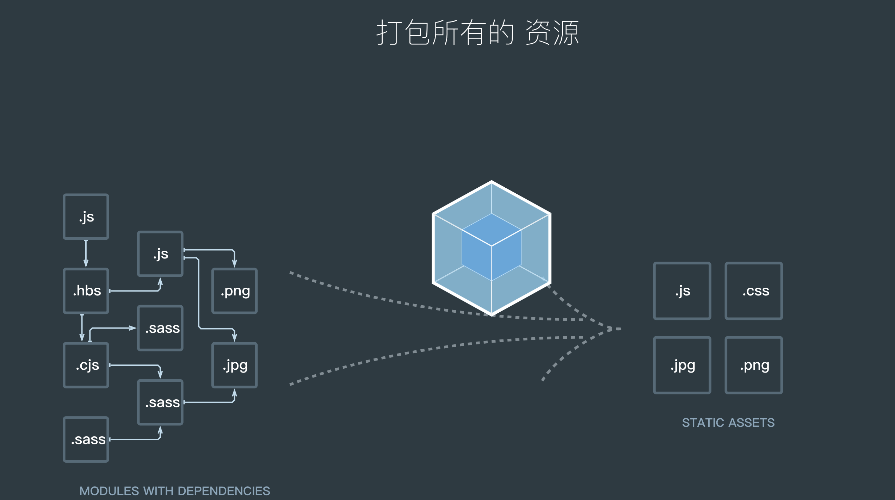

#### 1. webpack的基本原理

本质上，webpack 是一个现代 JavaScript 应用程序的静态模块打包器(module bundler)。当 webpack 处理应用程序时，它会递归地构建一个依赖关系图(dependency graph)，其中包含应用程序需要的每个模块，然后将所有这些模块打包成一个或多个 bundle。


> 这里的模块可以粗浅的理解为js文件、css文件、less文件、sass文件、图片文件。每个文件视为一个模块。
> 依赖关系可以理解为引用关系， a文件引用b文件，b文件引用c文件，建立引用关系需要一个根节点，这个跟节点所属的文件我们称之为入口(entry)，后面会讲到。

#### 2. webpack可以做什么

与其说webpack可以做什么，不如说webpack这个模块打包机在打包的时候都要干什么，梳理一下我们发现，webpack打包时主要做以下6件事。当然，你可以根据webpack的机制自定义插件，插件可以做任何你想做的事情。

1. 代码转换 

1.1.基于babel把es6-es10等高级代码转换为浏览器可以执行的es5代码。

1.2. 基于ts-loader把TypeScript 转为 JavaScript

1.3. 基于css的一些loader把less、scss转化为基础的css，并且可以把css中的px单位转化为rem，或者自动给样式添加浏览器前缀

2. 文件优化

2.1. 删除项目中的注释、删除冗余的console

2.2. html、css、js代码压缩，让代码体积变小

2.3. 抽离css文件，通过link引入

2.4 为css、js、图片文件增加指纹

3. 代码分隔

3.1 拆分出使用概率较低的模块，希望后期需要的时候异步加载

3.2 拆分出安装包，希望能利用浏览器缓存下部分不易变动的代码（如react或者react-dom依赖包和业务代码拆分开）

3.3 css拆分为独立的文件包，利用link标签引用

4. 模块合并

4.1 把react和react-dom类似的安装包合并为一个文件，

4.2 入口entry配置数组，数组内的文件就可以合并为通一个，如`entry: ['./a.js', './b.js']`

4.3 通过require或者import引入的文件被合并到同一个文件中

5. 自动刷新

5.1 通过配置webpack-dev-server创建开发服务器，实现代码从自动打包到自动刷新页面的自动化开发模式

6 代码校验

6.1 使用eslint检测js代码是否符合规范

6.2 使用csslini检测css代码是否符合规范


#### 3. webpack的基础操作

第一步： 安装npm并初始化项目

```js
npm init -y
npm i webpack webpack-cli -D
```

第二步：创建webpack 默认配置⽂文件：`webpack.config.js`

> 配置文件中大概包含以下几个几个关键词

```js
module.exports = {
  // 模式，可以选择开发环境或者是生产环境的模式。
  mode: '', 
  // 入口，打包时的入口文件相对地址，可以是一个或者数组类型的多个
  entry: '', 
  // 出口 ，打包出来的文件，可以是一个或者多个
  output: {},   
  // 决定如何处理不同类型的模块，可配置各种loader
  // https://www.webpackjs.com/configuration/module/
  module: {},
  // 插件是专注处理webpack在编译过程中的某个特定任务，可引用各种plugin
  plugins: []
}
```

下一章我们会重点讲解webpack的关键词以及用法
