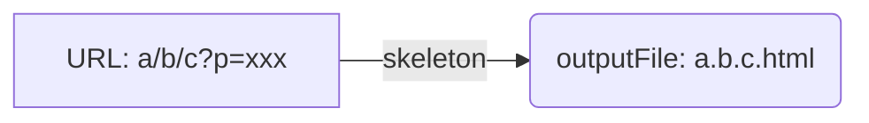
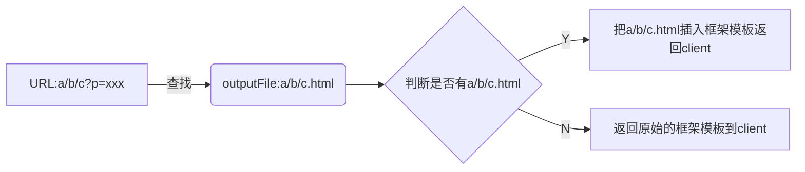

#### 骨架屏自动生成流程
###### 1.根据url生成骨架屏，并存到对应的文件中

###### 2.根据浏览器路由查找骨架屏html所在的文件，并插入到server，返回给client

#### 节点处理方案
- 预定义的需要被删除的节点  放进删除数组
- 预定义的需要被包含的节点 
- 不在视窗的节点要被删除 放进删除数组
- class属性中有display node的节点要被删除 放进删除数组
- 有伪类的节点放进伪类数组
- 有Border属性的，元素的style.border = 'node'
- 有ele.children.length > 0的(元素节点) 循环遍历，并重复上面的步骤
- 有UL或者OL的，直接调用handle.list处理
------------

- ele.childNodes（元素节点，文本节点，属性节点）遍历，只要是TEXT_NODE的都设置为透明，即元素是文字就设置为透明
- 文本修饰符属样式text-decotation 颜色设置为透明
- 隐藏所有svg元素
- style中有background 或者backgroundImage的放进背景图数组
- style中有gradient类型的background或者backgroundImage的放进gradientBackEles数组
- 是元素节点并且是button或者a标签的，放进button数组
- 如果是文本的，放进文本数组

#### 最终生成数组
- svgs svg数组
- texts  文本数组
- buttons 按钮数组
- hasImageBackEles  背景图数组
- imgs   图片数组
- pseudos   伪类数组
- gradientBackEles  gradient类的背景图数组
- grayBlocks  灰色块数组
- toRemove  需要被移除的数组

#### handler中的处理方法
- svg 
    - 宽高为0的或者属性aria-hidden：true直接移除
    - 清空innerHtml innerHtml = ''
    - 设置尺寸px为配置文件定义的尺寸（如rem）
    - 如果有透明色，设置透明TRANSPARENT
    - 如果没有透明色，background设置为自定义的颜色
    - 添加全局样式sk-svg
- text
    - 获取文本的宽度getBoundingClientRect
    - 宽度小于50直接隐藏
    - 获取计算样式getComputedStyle
    - 获取文本内容ele.textContent
    - 没有行高的默认行高为fontSize * 1.4
    - 没有定位(fixed,absolute,flex)的设置为relative
    - 获取文本整体高度offsetHeight，除去paddingTB，通过lineHeight计算有几行
    - 添加background-image样式，添加默认background样式
    - 添加sk-text class类，
    - 计算文本总宽度
        - 先生成一个span标签，把文本放进去，
        - 设置对应的style,
        - 把span放进浏览器
        - 计算这个span的总宽度
    - 文本居中时设置backgroundPositionX = '50%'
    - 文本居又时设置backgroundPositionX = '100%'
- buttons
    - 如果是要被排除的class 直接返回
    - 增加class类 sk-button
    - 设置样式 
        - color
        - background
        - border none
        - box-shadow none
    - 添加样式，并添加class
- background 背景图
    - 添加class sk-image
    - 添加自定义的背景色 color
    - 添加样式，添加类
- 图片image
    - 获取image宽高getBoundingClientRect
    - 重置图片的src为1像素的灰色图，横轴和纵轴重复宽高为上一步获取的宽高
    - 设置class类 sk-image
    - 设置背景色为配置的样色 color
    - 添加样式 添加class类
    - 如果有alt属性，移除alt
- 伪类 before after
    - 设置样式
        - 背景色设置为配置的样色
        - 背景图设置为空
        - 文本颜色设置为透明
        - border设置为透明
        - 正方形border-radius设置为 0
        - 圆形border设置为 50%
    - 添加样式
    - 添加类
- 灰色块grayBlocks
    - 添加class sk-gray
    - 设置样式
        - 文本颜色和背景色都设置为配置的color
    - 添加样式 添加class 类
    - 如果是文本的话，文本添加class sk-gray,这样所有的文本都是浅灰色了
- list处理 UL OL
    - 获取第一个节点
    - 删除其它li节点
    - 把其它li节点设置为第一个节点，保证一致性
    - 属于以上某个类型的再按以上的方法处理
 

##### 问题
- 对web服务有很强的侵入性
    - 需要修改server的res.send逻辑，插入对应的html片段
    - npm run build打包时需要修改打包逻辑，把outputFile文件骨架屏一起打包
- web server无法检测前端路由切换时url变化
- 
