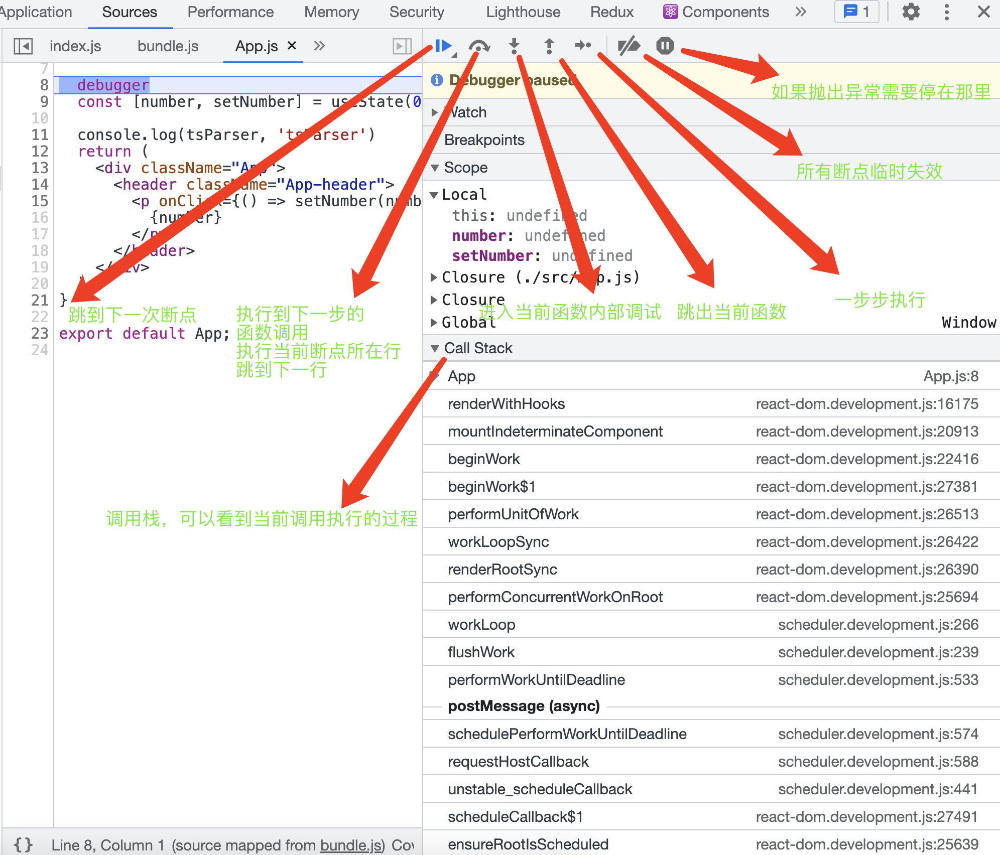
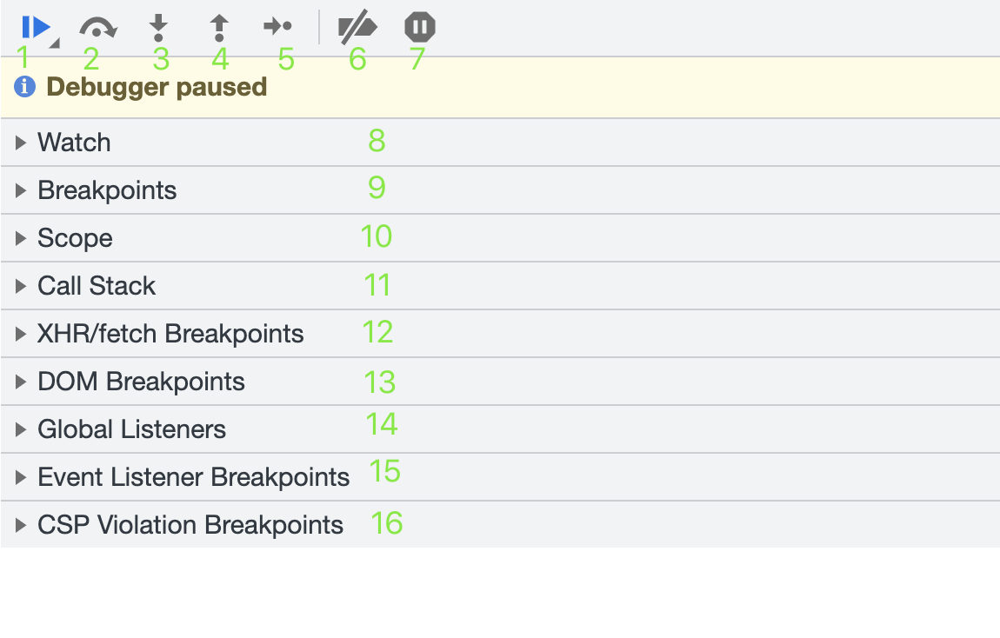
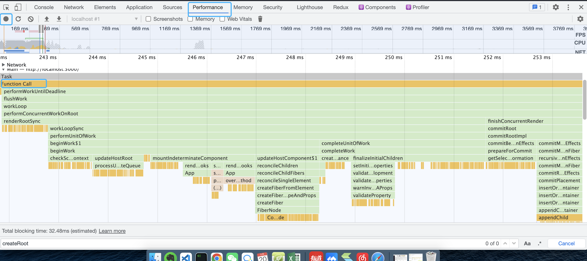

### chrome源码调试面板说明

#### debugger调试面板说明

###### 1-16 分别代表的意思

1. 跳到下一个debugger断点
2. 跳到下一个函数
3. 进入函数内部调试
4. 跳出当前函数
5. 一步步执行
6. 使所有断点临时失效
7. 要不要再异常处暂停
8. watch 监听表达式，把变量名或者表达式输入，每次刷新就可以实时观察变化
9. Breakpoints 记录了标记的所有断点，可以点击跳转
10. Scope 可以看到this指向，是否有值，断点是对象还是其它等有用的信息
11. Call stack 调用栈，函数调用的执行顺序，越往上，越是后执行的函数
12. XHR/fetch Breakpoints 针对某个请求或者请求的关键字设置断点
13. Dom Breakpoints 右键单机某个DOM元素，并选择Break on下的subtree modifications。这样调试器就可以在脚本遍历到改元素并且要修改它的时候自动停止，让用户进行调试检查
14. Global Listeners
15. Event Listener Breakpoints 监听到某个事件发生的时候回，断点暂停
16. CSP Violation Breakpoints 

### Performance 录制当前页面的执行顺序和函数调用栈顺序

下图调用栈充分说明了react调用顺序，调试源码很有用

