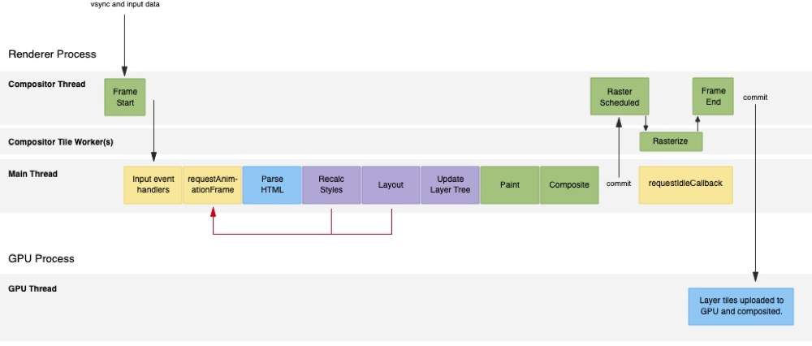

### 整体流程：

- Vsync 接收到 Vsync 信号，这一帧开始
  
- Input event handlers 之前 Compositor Thread 接收到的用户 UI 交互输入在这一刻会被传入给主线程，触发相关 event 的回调。
  
 > All input event handlers (touchmove, scroll, click) should fire first, once per frame, but that’s not necessarily the case; a scheduler makes best-effort attempts, the success of which varies between Operating Systems.
  
 这意味着，尽管 Compositor Thread 能在 16ms 内接收到 OS 传来的多次输入，但是触发相应事件、传入到主线程被 JS 感知却是每帧一次，甚至可能低于每帧一次。也就是说 touchmove、mousemove 等事件最快也就每帧执行一次，所以自带了相对于动画的节流效果！如果你的主线程有动画之类的卡了一点，事件触发频率非常可能低于 16ms。我在最开始关于渲染时机的内容中说了 scroll 和 resize 因为和渲染处于同一轮次，所以最快也就每帧执行一次，现在来看，不仅仅是 scroll 和 resize！连 touchmove、mousemove 等事件，由于 Compositor Thread 的机制原因，也依然如此！ 详见这个 jsfiddle，大家可以试试，你可以发现 mousemove 回调和 requestAnimationFrame 回调的调用频率是完全一致的，mousemove 的执行次数跟 raf 执行次数一模一样，永远没有任何一次出现 mousemove 执行两次而 rAF 还没有执行一次的情况发生。另外两次执行间隔在 14 到 20 毫秒之间，主要是因为帧的间隔不会精确到 16.666 毫秒哈，基本是 14ms~20ms 之间大致波动的，大家可以打开 timeline 观察。另外有个挺奇怪的现象是每次鼠标从 devtool 移回页面区域里的时候，会非常快的触发两次 mousemove（间隔有时小于 5ms），虽然依然每次 mousemove 后依然紧跟 raf，这意味着非常快速的触发了两帧。
  
- requestAnimationFrame 图中的红线的意思是你可能会在 JS 里 Force Layout，也就是我们说的访问了 scrollWidth、clientHeight、ComputedStyle 等触发了强制重排，导致 Recalc Styles 和 Layout 前移到代码执行过程当中。
- parse HTML 如果有 DOM 变动，那么会有解析 DOM 的这一过程。
- Recalc Styles 如果你在 JS 执行过程中修改了样式或者改动了 DOM，那么便会执行这一步，重新计算指定元素及其子元素的样式。
- Layout 我们常说的重排 reflow。如果有涉及元素位置信息的 DOM 改动或者样式改动，那么浏览器会重新计算所有元素的位置、尺寸信息。而单纯修改 color、background 等等则不会触发重排。详见 css-triggers。
- update layer tree 这一步实际是更新 Render Layer 的层叠排序关系，也就是我们之前说的为了搞定层叠上下文搞出的那个东西，因为之前更新了相关样式信息和重排，所以层叠情况也可能变动。
  
- Paint 其实 Paint 有两步，第一步是记录要执行哪些绘画调用，第二步才是执行这些绘画调用。第一步只是把所需要进行的操作记录序列化进一个叫做 SkPicture 的数据结构里:
  
 The SkPicture is a serializable data structure that can capture and then later replay commands, similar to a display list.
  
 这个 SkPicture 其实就一个列表，记录了你的 commands。接下来的第二步里会将 SkPicture 中的操作 replay 出来，这里才是将这些操作真正执行：光栅化和填充进位图。主线程中和我们在 Timeline 中看到的这个 Paint 其实是 Paint 的第一步操作。第二步是后续的 Rasterize 步骤（见后文）。
  
 - Composite 主线程里的这一步会计算出每个 Graphics Layers 的合成时所需要的 data，包括位移（Translation）、缩放（Scale）、旋转（Rotation）、Alpha 混合等操作的参数，并把这些内容传给 Compositor Thread，然后就是图中我们看到的第一个 commit：Main Thread 告诉 Compositor Thread，我搞定了，你接手吧。然后主线程此时会去执行 requestIdleCallback。这一步并没有真正对 Graphics
Layers 完成位图的 composite。
  
- Raster Scheduled and Rasterize 第 8 步生成的 SkPicture records 在这个阶段被执行。
  
 SkPicture records on the compositor thread get turned into bitmaps on the GPU in one of two ways: either painted by Skia’s software rasterizer into a bitmap and uploaded to the GPU as a texture, or painted by Skia’s OpenGL backend
(Ganesh) directly into textures on the GPU.
  
 可以看出 Rasterization 其实有两种形式：
  
 一种是基于 CPU、使用 Skia 库的 Software Rasterization，首先绘制进位图里，然后再作为纹理上传至 GPU。这一方式中，Compositor Thread 会 spawn 出一个或多个 Compositor Tile Worker Thread，然后多线程并行执行 SkPicture records 中的绘画操作，以之前介绍的 Graphics Layer 为单位，绘制 Graphics Layer 里的 Render Object。同时这一过程是将 Layer 拆分为多个小 tile 进行光栅化后写入进 tile 对应的位图中的。
另一种则是基于 GPU 的 Hardware Rasterization，也是基于 Compositor Tile Worker Thread，也是分 tile 进行，但是这个过程不是像 Software Rasterization 那样在 CPU 里绘制到位图里，然后再上传到 GPU 中作为纹理。而是借助 Skia’s OpenGL backend (Ganesh) 直接在 GPU 中的纹理中进行绘画和光栅化，填充像素。也就是我们常说的 GPU Raster。
  
 现在基本最新版的几大浏览器都是硬件 Rasterization 了，但是对于一些移动端基本还是 Software Rasterization 较多。打开你的 chrome 浏览器输入 chrome://gpu/ 可以看看你的 chrome 的 GPU 加速情况。下图是我的：使用 Hardware Rasterization 的好处在于：以往 Software Rasterization 的方式，受限于 CPU 和 GPU 之前的上传带宽，把位图从 RAM 里上传到 GPU 的 VRAM 里的过程是有不可忽视的性能开销的。若 Rasterization 的区域较大，那么使用 Software Rasterization 很可能在这里出现卡顿。下面这个例子是 Chrome32 和 Chrome41 的对比，后者的版本实现了 Hardware
Rasterization。 不过，对于图片、canvas 等情况，我没有查到到底是怎么处理的，但是我觉得绝对是有一个从 CPU 上传到 GPU 的过程的，所以应该有一些情况不是纯 Hardware Rasterization 的，两者应该是结合使用的。另外就是硬件还是软件 Rasterization 主要还是由设备决定的，在这个地方并没有我们手动优化的空间，但是这里涉及到一些后面的内容，所以简单介绍了一下。
  
  
 - commit 如果是 Software Rasterization，所有 tile 的光栅化完成后 Compositor Thread 会 commit 通知 GPU Thread，于是所有的 tile 的位图都会作为纹理都会被 GPU Thread 上传到 GPU 里。如果是使用 GPU 的 Hardware Rasterization，那么此时纹理都已经在 GPU 中。接下来，GPU Thread 会调用平台对应的 3D API(windows 下是 D3D，其他平台都是 GL)，把所有纹理绘制到最终的一个位图里，从而完成纹理的合并。 同时，非常关键的一点：在纹理的合并时，借助于 3D API 的相关合成参数，可以在合并前对纹理 transformations（也就是之前提到的位移、旋转、缩放、alpha 通道改变等等操作），先变形再合并。合并完成之后就可以将内容呈现到屏幕上了。

参考链接：

- https://github.com/hushicai/hushicai.github.io/issues/5
- https://zhuanlan.zhihu.com/p/352082916
- https://chromium.googlesource.com/chromium/src/+/refs/heads/main/docs/life_of_a_frame.md
- https://aerotwist.com/blog/the-anatomy-of-a-frame/
- https://juejin.cn/post/6844903506059477000
