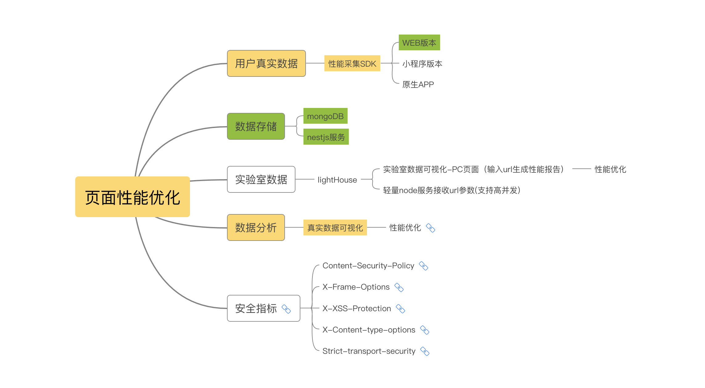

### 项目架构介绍

- 项目分为以下5个部分
  - 真实数据采集sdk
    - web pc&h5
    - 小程序版本
    - 原生app内嵌H5
  - 真实数据上报
    - 调接口，使用1px.png图片上报
    - sendBeacon 直接发送
  - 真实数据存储
    - mongodb
    - nest服务
  - 实验室数据采集
    - lighthouse 输入url生成页面分析报告
    - 基于lighthouse 的轻量node服务，接收url生成在node端生成分析报告json格式，格式化数据后拿到前端可视化展示
  - 数据分析
    - 真实数据分析
    - 实验室数据分析

### 页面安全性
> 我们把安全指标也归类为页面性能的一部分，包括5个方面 [页面安全性分析]( https://snyk.io/blog/website-security-score-explained/)

  -  Content-Security-Policy adds 25 points
	
  -  X-Frame-Options adds 20 points
	
  -  X-XSS-Protection adds 20 points 
	
  -  X-Content-type-options adds 20 points 
	
  -  Strict-transport-security adds 25 points, only if the website tested is on HTTPS[链接](https://developer.mozilla.org/zh-CN/docs/Web/HTTP/Headers/Strict-Transport-Security)

  